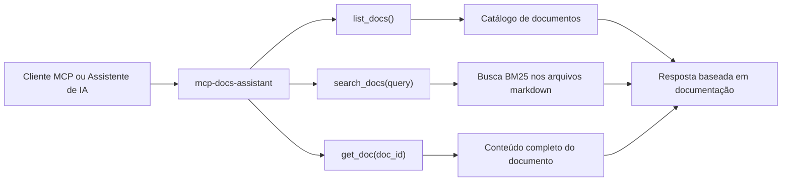
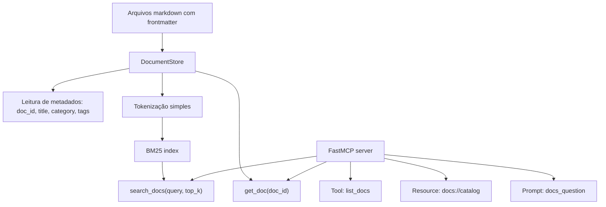
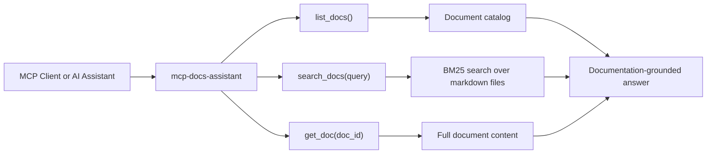

# mcp-docs-assistant

## PT-BR

Servidor MCP read-only para consulta de documentação local. O projeto expõe documentos markdown como recursos e ferramentas MCP, permitindo que um cliente compatível pesquise políticas, runbooks e padrões internos de forma estruturada.

### O que este projeto demonstra

- uso prático de `Model Context Protocol (MCP)`
- servidor MCP local com transporte padrão por `stdio`
- exposição de `resources`, `tools` e `prompts`
- busca semântica leve em documentação local com `BM25`
- abordagem segura e read-only para conhecimento interno

### Fluxograma do Case



### Pipeline Técnico



### Ferramentas expostas

- `list_docs()`: lista os documentos disponíveis
- `search_docs(query, top_k)`: busca nos documentos locais
- `get_doc(doc_id)`: recupera o conteúdo completo de um documento

### Resource exposto

- `docs://catalog`: catálogo textual da documentação disponível

### Estrutura

- `src/server.py`: servidor MCP com `FastMCP`
- `src/document_store.py`: carregamento e busca dos documentos
- `docs/*.md`: base local de conhecimento
- `tests/test_document_store.py`: testes da camada de busca

### Como executar

```bash
python3 -m venv .venv
source .venv/bin/activate
pip install -r ../requirements.txt
python3 src/server.py
```

### Como adaptar para seu contexto real

1. substitua os arquivos em `docs/` por políticas, runbooks ou documentação real;
2. mantenha a camada MCP read-only para segurança;
3. conecte o servidor a um client MCP para consulta assistida por IA.

---

## EN

Read-only MCP server for querying local documentation. The project exposes markdown documents as MCP resources and tools, allowing compatible clients to search policies, runbooks, and internal standards in a structured way.

### What this project demonstrates

- practical usage of `Model Context Protocol (MCP)`
- local MCP server with default `stdio` transport
- exposure of `resources`, `tools`, and `prompts`
- lightweight semantic retrieval over local docs with `BM25`
- secure read-only approach for internal knowledge access

### Exposed tools

- `list_docs()`: list available documents
- `search_docs(query, top_k)`: search across local documents
- `get_doc(doc_id)`: fetch a full document by id

### Exposed resource

- `docs://catalog`: textual catalog of the available documentation

### Structure

- `src/server.py`: MCP server built with `FastMCP`
- `src/document_store.py`: document loading and search layer
- `docs/*.md`: local knowledge base
- `tests/test_document_store.py`: tests for the retrieval layer

### Run

```bash
python3 -m venv .venv
source .venv/bin/activate
pip install -r ../requirements.txt
python3 src/server.py
```

### How to adapt it to your real context

1. replace the files in `docs/` with real policies, runbooks, or internal documentation;
2. keep the MCP layer read-only for safety;
3. connect the server to an MCP client for AI-assisted document access.

### Case Flow Diagram



### Technical Pipeline


